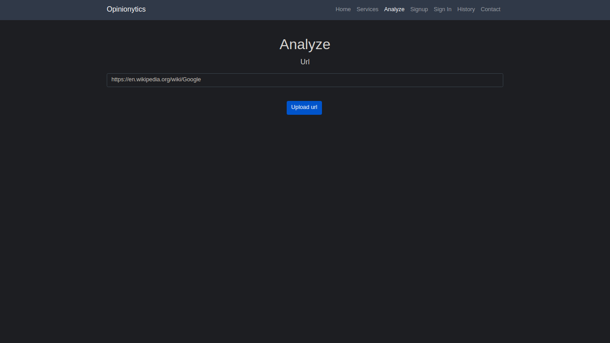
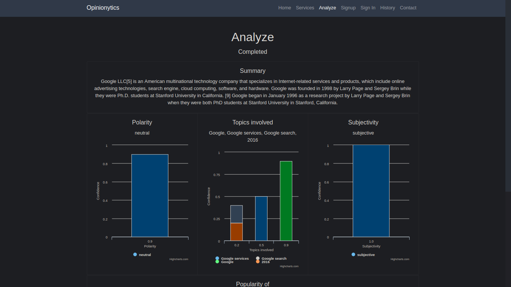
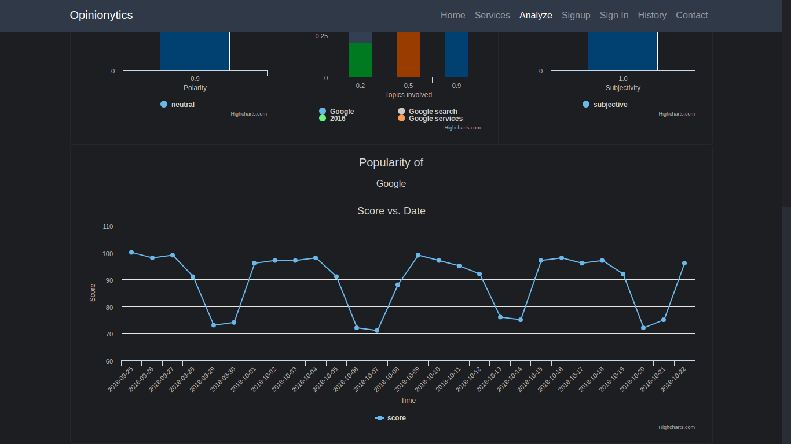

# Opinionytics

A simple way to view all the informations about any text out there.

## Archives

- [opinionytics](https://opinionytics.github.io/opinionytics/)
  The source code of Opinionytics in python and django
- [opinionytics-features-python](https://opinionytics.github.io/opinionytics-features-python/)
  The source code of Opinionytics features in python

## Presentations

- [2018 INSA Lyon presentation](https://docs.google.com/presentation/d/e/2PACX-1vQ8ayruCshJ1-V7yVsk3UCTusUMwVQ9t9YVeLlngkWkgPcB0s194Jl0UhScjZrRmSsOiqfYsOTOeeJz/pub?start=false&loop=false&delayms=3000)
  The final INSA Lyon Présentation of the project

## Medias

- [🇫🇷 Data mining for Fil Rouge project at INSA de Lyon](https://www.youtube.com/watch?v=e_a-t3BJk8I&t=20s)
- Demonstration
  
  
  

## Social Medias

[Facebook](https://www.facebook.com/opinionytics),
[Github](https://www.github.com/opinionytics),
[Instagram](https://www.instagram.com/opinionytics),
[Twitter](https://www.twitter.com/opinionytics),
[Medium](https://www.medium.com/@opinionytics)

## Authors

- [Mohamed Amine Boulouma](https://github.com/aminemboulouma)
- [Joan Capelle Gracia](https://github.com/zas97)
- [Charlotte Delfosse](https://github.com/cdel2)
- [Pierre Faure-Giovagnoli](https://github.com/PierreFG)
- [Aina Rasoldier](https://github.com/ainar)
